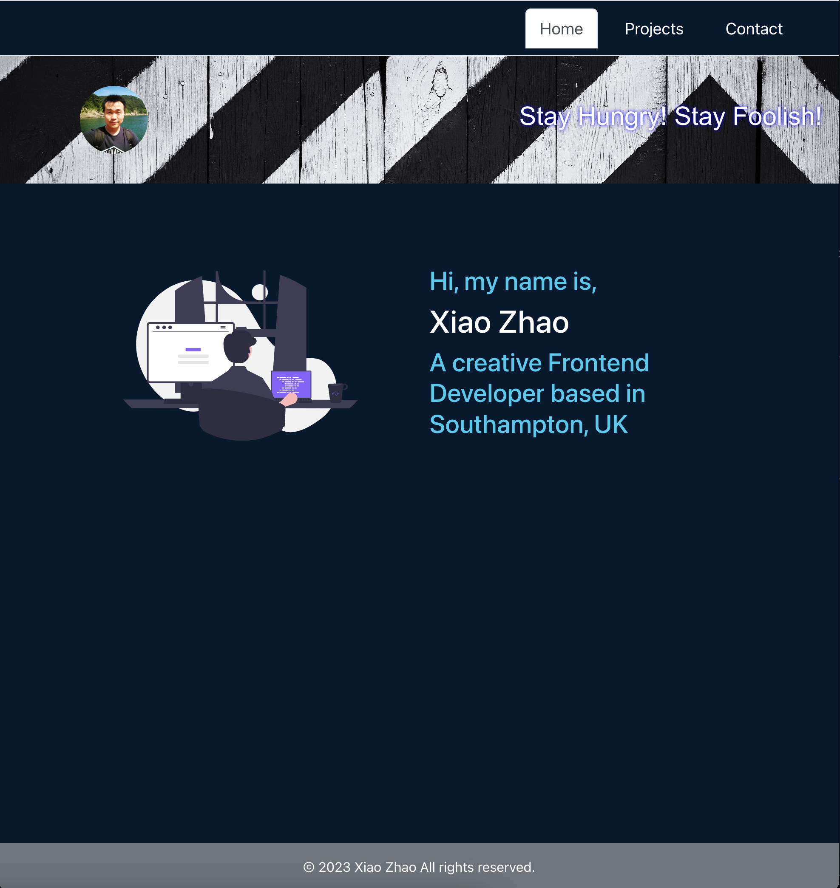
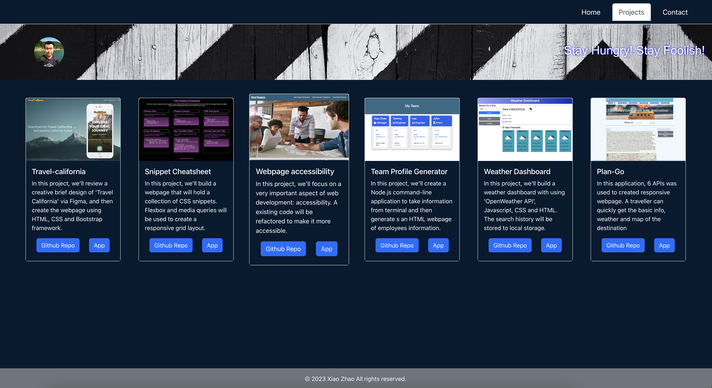

# React Portfolio

For this challenge, we will utilize what we have learned in `Module 13: React` at the edX BootCamp for Frontend Web Development to develop the initial scaffolding of our portfolio sites.

## Requirements

### Design

Remember, "good" design is subjective. Your site should look "polished" and "professional". Here are a few guidelines on what that means:

* Mobile-first design

* Choose a color palette for your site so it doesn't just look like
the default bootstrap theme or an unstyled HTML site.

* Make sure the font size is large enough to read and that the colors don't cause eye strain.

### Base Requirements

* Technologies that must be used:
  * [ ] React
  * [ ] Navigation with `React Router`, dynamic rendering, or another third part router
* Your portfolio **must contain** the following information:
  * [ ] Your name
  * [ ] Links to your:
    * [ ] GitHub Profile
    * [ ] LinkedIn Page
    * [ ] Email Address
    * [ ] Phone Number - (optional)
    * [ ] PDF version of your resume
      * Your resume **must** contain up-to-date projects and professional experience
    * [ ] A list of projects (Challenges or Projects). For each project, make sure you have the following:
      * [ ] Project title
      * [ ] Link to the deployed version
      * [ ] Link to the GitHub repository
      * [ ] GIF or screenshot of the deployed application

### Required Components

* At a minium, your portfolio must render these 6 components:
  1. [ ] App
  2. [ ] Header
  4. [ ] Home
  5. [ ] Project Gallery
  6. [ ] Project
  7. [ ] Contact

### Required Component Content
* [ ] App:
  * [ ] Must be your top level component and render all necessary children components
* [ ] Header:
   * [ ] Must be rendered across the entire site
   * [ ] Must Contain a Navbar
* [ ] Project Gallery:
  * [ ] Must render dynamically 6 instances of the Project component
    * [ ] Be sure to store your project data in a JSON file and import it into your project
* [ ] Project:
   * [ ] Must be a reusable component that ingests JSON data as a props and renders a single instance for each project.
   * [ ] Must utilize router props to properly render the right project based on user selection
   * [ ] Must render the following info:
     * [ ] Project title
     * [ ] Link to the deployed version
     * [ ] Link to the GitHub repository
     * [ ] GIF or screenshot of the deployed application
* [ ] Contact:
  * [ ] Must have contact information
  * [ ] Have a contact form for handling events
* [ ] Home:
  * This should be a welcome landing page that contains:
     * [ ] Your Name
     * [ ] A Headshot of you
     * [ ] Your brand statement
     * [ ] Some indication that this is your portfolio site

### Updated Social Media Presence
#### LinkedIn

* Make sure to update your LinkedIn Profile with the new skills you've acquired since the last time it was updated.
* If you do not have a LinkedIn profile, please create one.
#### GitHub

* Update GitHub profile with pinned repositories featuring those same projects.

## Deployed webpage
Here are the screenshots of the [deployed application](https://courageous-crisp-0050b3.netlify.app/).

## Contribution 
Feel free to contribute with the git workflow. Please follow the [contributing guide](https://github.com/github/docs/blob/main/CONTRIBUTING.md).

## License
No license used for this application.